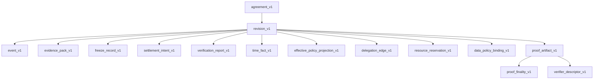

# Schemas

This directory contains the current machine-readable schema snapshot for ACP.

## Scope in this snapshot
- `core/`: core schema set with Core-15 coverage
- `companion/`: binding and companion schema surfaces
- `meta/`: reason-code and status-register registries
- `vectors/`: valid/invalid starter vectors and manifest

## Notes
- Core definition remains 15 artifacts even when publication is phased.
- Core and companion schemas use `required`, `additionalProperties: false`, and
  baseline constraints (`format`, `pattern`, `minLength`, `minimum`) as release
  quality guardrails.
- Companion/binding schemas remain accountability bindings and do not replace
  Core semantics.
- Cross-schema linkage is encoded at the artifact/reference-field level and in
  conformance profile `schema_map` declarations.

## Core Relationship Map

## Reference-Field Linkage

| Source artifact | Reference fields | Target artifact/domain |
|---|---|---|
| `revision_v1` | `agreement_id` | `agreement_v1` |
| `event_v1` | `agreement_id`, `revision_id` | `agreement_v1`, `revision_v1` |
| `proof_artifact_v1` | `verifier_ref` | `verifier_descriptor_v1` (`verifier_id`) |
| `proof_finality_v1` | `proof_id` | `proof_artifact_v1` |
| `effective_policy_projection_v1` | `binding_id`, `time_fact_ref` | `data_policy_binding_v1`, `time_fact_v1` |
| `delegation_edge_v1` | `parent_revision_id`, `child_revision_id`, `child_agreement_id` | `revision_v1`, `agreement_v1` |
| `resource_reservation_v1` | `parent_subject_ref`, `child_subject_ref` | Subject domain identifiers |
| Companion bindings | `*_schema_ref`, rule refs | Core schema files and external policy/runtime refs |

## Validation
- All JSON files in this directory parse with `jq`.
- `vectors/` are intended for schema-structure conformance checks.
